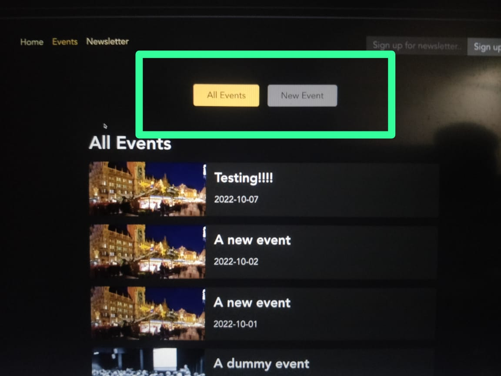

# About Project App

## Live App link

<a href="https://PSoni2000.github.io/multi-page-sap-with-react-router"
target="_blank" style='font-size:1.2rem; font-weight:bold;'>multi-page-sap-with-react-router</a>

## Language / Library Used

1. React JS
2. react-router-dom

## Future Plans

# NOTES

Routes are simply path <=> component mappings
so for which path (like '/products') should which components (like < Products />) be loaded?

## Create Routes

```
import { createBrowserRouter, RouterProvider } from 'react-router-dom';

import HomePage from './pages/Home';
import ProductsPage from './pages/Products';

const router = createBrowserRouter([
  { path: '/', element: <HomePage /> },
  { path: '/products', element: <ProductsPage /> },
]);

function App() {
  return <RouterProvider router={router} />;
}

export default App;
```

### Creating Routes using Class Based Components

```
import {
  createRoutesFromElements,
  RouterProvider,
  Route,
} from 'react-router-dom';

import HomePage from './pages/Home';
import ProductsPage from './pages/Products';

const routeDefinitions = createRoutesFromElements(
  <Route>
    <Route path="/" element={<HomePage />} />
    <Route path="/products" element={<ProductsPage />} />
  </Route>
);

const router = createBrowserRouter(routeDefinitions);

function App() {
  return <RouterProvider router={router} />;
}

export default App;
```

## Adding Link in Application

```
import { Link } from 'react-router-dom';

function HomePage() {
  return (
    <>
      <h1>My Home Page</h1>
      <p>
        Go to <Link to="/products">the list of products</Link>.
      </p>
    </>
  );
}

export default HomePage;
```

## Adding Wrappers in routes -

```
const router = createBrowserRouter([
	{
		path: "/",
		element: <RootLayout />,
		children: [
			{ path: "/", element: <HomePage /> },
			{ path: "/products", element: <ProductsPage /> },
		],
	},
]);
```

here '\<RootLayout>' works as wrapper/parent component for routes under children: attributes.

_RootLayout-_

```
import { Outlet } from 'react-router-dom';

import MainNavigation from '../components/MainNavigation';
import classes from './Root.module.css';

function RootLayout() {
  return (
    <>
      <MainNavigation />
      <main className={classes.content}>
        <Outlet />
      </main>
    </>
  );
}

export default RootLayout;
```

here /<Outlet> will mark the place where the child routes elements render to.

### Nesting Wrappers in routes

## Showing error page with errorElement

```
const router = createBrowserRouter([
  {
    path: '/',
    element: <RootLayout />,
    errorElement: <ErrorPage />,
    children: [
      { path: '/', element: <HomePage /> },
      { path: '/products', element: <ProductsPage /> },
    ],
  }
]);
```

here errorElement render the /<ErrorPage/> as an fallback page if any error occur.

## NavLink - Navigation Link

```
function MainNavigation() {
  return (
    <header className={classes.header}>
      <nav>
        <ul className={classes.list}>
          <li>
            <NavLink
              to="/"
              className={({ isActive }) =>
                isActive ? classes.active : undefined
              }
              end
            >
              Home
            </NavLink>
          </li>
          <li>
            <NavLink
              to="/products"
              className={({ isActive }) =>
                isActive ? classes.active : undefined
              }
            >
              Products
            </NavLink>
          </li>
        </ul>
      </nav>
    </header>
  );
}
```

here _NavLink_ is just like an Link but it has an extra feature if we add className, the className function will receive isActive property which tells us whether link is active or not.

by default NavLink checks whether the path of the Currently active route starts with the path of one of those NavLinks. And the Nav Link is consider to be active if the currently active route start with the path set on the link.
with this behavior a link could be treaded as active even if you're on some nested child route.

to resolve it in our case we use _end_ prop. which we can set to true or false
`end={true}`

## Navigating Programmatically

```
import { Link, useNavigate } from 'react-router-dom';

function HomePage() {
  const navigate = useNavigate();

  function navigateHandler() {
    navigate('/products');
  }

  return (
    <>
      <h1>My Home Page</h1>
      <p>
        Go to <Link to="/products">the list of products</Link>.
      </p>
      <p>
        <button onClick={navigateHandler}>Navigate</button>
      </p>
    </>
  );
}

export default HomePage;
```

_useNavigate_ - can be used for Navigating Programmatically. in case some form was submitted or some timer expired. you want to trigger a navigation action from inside code

## Defining & using Dynamic Routes

Dynamic path segments or path parameters -
You add a parameter to a dynamic path segment by adding a colon ':' an then any identifier of your choice.

```
const router = createBrowserRouter([
  {
    path: '/',
    element: <RootLayout />,
    errorElement: <ErrorPage />,
    children: [
      { path: '/', element: <HomePage /> },
      { path: '/products', element: <ProductsPage /> },
      { path: '/products/:productId', element: <ProductDetailPage /> }
    ],
  }
]);
```

to get prop in ProductDetails page we use useParams hook

```
import { useParams } from 'react-router-dom';

function ProductDetailPage() {
  const params = useParams();

  return (
    <>
      <h1>Product Details!</h1>
      <p>{params.productId}</p>
    </>
  );
}

export default ProductDetailPage;
```

## Absolute & Relative paths

_Absolute path_ - '/', '/roots', '/products/:id' where we give absolute path
_Relative path_ - '', 'root', 'products/:id' where we give path related to current path location.

## Index Routes

```
const router = createBrowserRouter([
  {
    path: '/',
    element: <RootLayout />,
    errorElement: <ErrorPage />,
    children: [
      { index: true, element: <HomePage /> },
      { path: 'products', element: <ProductsPage /> },
      { path: 'products/:productId', element: <ProductDetailPage /> }
    ],
  }
]);
```

Setting 'index: true' means it's the default route. that should be displayed if the parent route's path is currently active.

## Loader() functions

This feature is available if you are using React-Router-DOM version 6 or higher.

we can use Loader() in place of useEffect() hook where we are first rendering component then fetch data. but in Loader() react-router try fetching data as soon as component start rendering which is optimal for fast loading.

_Code for loading the data -_

```
const router = createBrowserRouter([
  {
    path: '/',
    element: <RootLayout />,
    children: [
      { index: true, element: <HomePage /> },
      {
        path: 'events',
        element: <EventsRootLayout />,
        children: [
          {
            index: true,
            element: <EventsPage />,
            loader: async () => {
              const response = await fetch('http://localhost:8080/events');

              if (!response.ok) {
                // ...
              } else {
                const resData = await response.json();
                return resData.events;
              }
            },
          },
          { path: ':eventId', element: <EventDetailPage /> },
          { path: 'new', element: <NewEventPage /> },
          { path: ':eventId/edit', element: <EditEventPage /> },
        ],
      },
    ],
  },
]);
```

_loader_ is a property that wants a function. and this function will be executed by react-router whenever you are about to visit this route.
So, just before route gets rendered, loader function will be triggered and executed by a react-router.

_Code for getting loaded data in event file -_

```
import React from "react";
import { useLoaderData } from "react-router-dom";
import EventsList from "../components/EventsList";

function EventsPage() {
	const events = useLoaderData();

	return <EventsList events={events} />;
}

export default EventsPage;
```

You can use useLoaderData() in the element that's assigned to a route and in all components that might be using inside that element.

### Challenges when using loader()

loader() approach we have a small issue. When user click on a NavLink which is loading some data, user might feel nothing happen after click on NavLink until data loaded completely\_

We have 2 ways to solve this issue

### Solution 1 - Give user Feedback by Reflecting The current navigation state in the UI

react-router gives us a special hook **useNavigation()**, which can be used to check the current route transition state. So, to find out if a transition has been initiated and we're currently still waiting for data to arrive, or if we're done.

useNavigation() hook - it's a hook provided by react router that lets us find out whether we're currently in a active transition, if we're loading data,
or if we have no active transition going on, we get a Navigation object when we call use Navigation.

navigation.state may have any of 3 strings -

1. idle - don;t have any active route transition
2. loading - having active transition & we're loading data
3. submitting - submitting data

```
import {Outlet, useNavigation} form 'react-router-dom';

function RootLayout(){
  const navigation = useNavigation();

  return (
    <>
      <main>
        {navigation.state === 'loading' && <p>Loading...</p>}
        <Outlet>
      </main>
    </>
  )
}
```

### Solution 2 - returning Response in loader()

react router support response object.

```
import React from "react";
import { useLoaderData } from "react-router-dom";

import EventsList from "../components/EventsList";

function EventsPage() {
	const data = useLoaderData();
  const events = data.events;

	return <EventsList events={events} />;
}

export default EventsPage;

export async function loader() {
	const response = await fetch("http://localhost:8080/events");

	if (!response.ok) {
		// ...
	} else {
		return response
	}
}
```

## Error Handling with custom errors

we can throw an error by using 'throw' keyword just like JavaScript

```
export async function loader() {
  const response = await fetch('http://localhost:8080/events');

  if (!response.ok) {
    // return { isError: true, message: 'Could not fetch events.' };
    throw { message: 'Could not fetch events.'}
  } else {
    return response;
  }
}
```

when an error gets thrown in a loader then react router will simply render the closest errorElement.

_errorElement_ will be shown to the screen whenever an error is generated in any route related code, including loaders.

```
const router = createBrowserRouter([
  {
    path: '/',
    element: <RootLayout />,
    errorElement: <ErrorPage />,
    children: [
      { index: true, element: <HomePage /> },
      {
        path: 'events',
        element: <EventsRootLayout />,
        children: [
          {
            index: true,
            element: <EventsPage />,
            loader: eventsLoader,
          },
          { path: ':eventId', element: <EventDetailPage /> },
          { path: 'new', element: <NewEventPage /> },
          { path: ':eventId/edit', element: <EditEventPage /> },
        ],
      },
    ],
  },
]);
```

_Errors bubble up_
so if we add errorElement in deeply nested route like here

```
{
  path: 'events',
  element: <EventsRootLayout />,
  errorElement: <ErrorPage />, // if below errorElement not present then only it catches error.
  children: [
    {
      index: true,
      element: <EventsPage />,
      errorElement: <ErrorPage />, // Catches error first.
      loader: eventsLoader,
    },
    { path: ':eventId', element: <EventDetailPage /> },
    { path: 'new', element: <NewEventPage /> },
    { path: ':eventId/edit', element: <EditEventPage /> },
  ],
},
```

## Extracting Error Data & throwing Response

To get the thrown error in ErrorElement Component we can use **useRouteError** hook. it gives as an error object. shape of this error object depends on whether you threw an response or any other kind an error object or data. if we threw an response it will give us error object which will include a status field.

```
import { useRouteError } from 'react-router-dom';
import MainNavigation from '../components/MainNavigation';

import PageContent from '../components/PageContent';

function ErrorPage() {
  const error = useRouteError();

  let title = 'An error occurred!';
  let message = 'Something went wrong!';

  if (error.status === 500) {
    message = JSON.parse(error.data).message;
  }

  if (error.status === 404) {
    title = 'Not found!';
    message = 'Could not find resource or page.';
  }

  return (
    <>
      <MainNavigation />
      <PageContent title={title}>
        <p>{message}</p>
      </PageContent>
    </>
  );
}

export default ErrorPage;
```

_Throwing error code -_

```
export async function loader() {
  const response = await fetch('http://localhost:8080/events');

  if (!response.ok) {
    // return { isError: true, message: 'Could not fetch events.' };
    throw new Response(JSON.stringify({ message: 'Could not fetch events.' }), {
      status: 500,
    });
  } else {
    return response;
  }
}
```

## json() utility function

Instead of creating responses manually like this & returning like this

_throwing -_

```
throw new Response(JSON.stringify({ message: 'Could not fetch events.' }), {
      status: 500,
    });
```

_catching -_

```
  if (error.status === 500) {
    message = JSON.parse(error.data).message;
  }
```

we can return the result of calling json, written like this

_throwing -_

```
throw json(
      { message: 'Could not fetch events.' },
      { status: 500, }
    );
```

_catching -_

```
 if (error.status === 500) {
    message = error.data.message;
  }
```

json() is a function that creates a response object that include data in the json format. and you can pass a second argument where you can set the extra response metadata like status

with json() you don't just type less code here, but in the place where you use the response data you also don't have to parse the json format manually.

## Dynamic Routing & Loader()

As hooks can't be accessed in loader() functions. but we still can get access to the route parameter that we need because React Router which calls this loader() function for us, actually passes an object to this loader function when executing it for us. and this object contains

1. request property - which contains a request object
2. params property - which contains an object with all your route parameters.

```
export async function loader({request, params}) {
  console.log(request.url);
  const id = params.eventId;

  const response = await fetch('http://localhost:8080/events/' + id);

  if (!response.ok) {
    throw json({message: 'Could not fetch details for selected event.'}, {
      status: 500
    })
  } else {
    return response;
  }
}
```

## useRouteLoaderData() Hook & Accessing Data from Other Routes

To reduce the loader() calls to backend we can share the loader() with other routes as well by using nested routes feature like this

```
const router = createBrowserRouter([
  {
    path: '/',
    element: <RootLayout />,
    errorElement: <ErrorPage />,
    children: [
      { index: true, element: <HomePage /> },
      {
        path: 'events',
        element: <EventsRootLayout />,
        children: [
          {
            index: true,
            element: <EventsPage />,
            loader: eventsLoader,
          },
          {
            path: ':eventId',
            id: 'event-detail',
            loader: eventDetailLoader,
            children: [
              {
                index: true,
                element: <EventDetailPage />,
              },
              { path: 'edit', element: <EditEventPage /> },
            ],
          },
          { path: 'new', element: <NewEventPage /> },
        ],
      },
    ],
  },
]);
```

now this loader: eventDetailLoader will execute when every we visit this route (':eventId') or 'edit' route. and that allows us to reuse the logic and data of that loader in both these routes down here.

Now if we tried to get loader value we will get error with useLoaderData hook. the reason for this is that by default when we use useLoaderData, it searches for the closest available loader data, and the highest level at which it looks for data is the route definition of the route for which this component was loaded.

So. in this case, the highest level it looks for the data is this edit route here.

Now to get the loader data from parent route we first need to add a special "id" property to the parent route like -

```
  {
    path: ':eventId',
    id: 'event-detail',
    loader: eventDetailLoader,
    children: [
      {
        index: true,
        element: <EventDetailPage />,
      },
      { path: 'edit', element: <EditEventPage /> },
    ],
  },
```

and then instead of using useLoaderData we use a slightly different hook which is called **useRouteLoaderData**.

**useRouteLoaderData** hook works almost like useLoaderData but it takes a route ID as an argument.

```
  import { useRouteLoaderData } from 'react-router-dom';

  import EventForm from '../components/EventForm';

  function EditEventPage() {
    const data = useRouteLoaderData('event-detail');

    return <EventForm event={data.event} />;
  }

  export default EditEventPage;
```

## action() functions

Just as we can add loaders to load data, we can also add actions to send data.

```
export async function action({ request, params }) {
  const data = await request.formData();

  const eventData = {
    title: data.get('title'),
    image: data.get('image'),
    date: data.get('date'),
    description: data.get('description'),
  };

  const response = await fetch('http://localhost:8080/events', {
    method: 'POST',
    headers: {
      'Content-Type': 'application/json',
    },
    body: JSON.stringify(eventData),
  });

  if (!response.ok) {
    throw json({ message: 'Could not save event.' }, { status: 500 });
  }

  return redirect('/events');
}
```

Now, the great thing about react-router is that it makes handling form submission a brace and it helps with extracting data from that form.

for that we should make sure -

1. All of our inputs have the name attribute because these names will later be used for extracting the data.
2. Replace form component with special "Form" component which is provided by react-router-dom
   This Form tag will make sure that the browser default of sending the request to the backend will be omitted but it will take that request that would've been sent and give it to your action
3. Add method property and set it to post (any Rest method).

As action function is executed by react-router and it receives an object that include a couple of helpful properties.

1. request - contains form data.
2. params

to get the form data from request we need to use -

```
const data = await request.formData();
const enteredTitled = data.get('title')
```

Now as this event data should be send to the backend. we have to convert it to JSON. we can do it by using JSON.stringify().

Now if you want to navigate user to a different page after successfully submitting the form. to do that you can return the result of calling Redirect.

like json, redirect creates a response object, however its a special response object that simply redirect the user to a different page.

## Submitting data Programmatically

The standard way we use above will automatically trigger the action route of the currently active route.
you could send the request to a different route by using the action prop in the Form component. and set it to any other path.
In that case the action of the other part will be triggered.
but if you wanna trigger the action of currently active path you don't need the action prop.

**Submitting data Programmatically**
just like we can navigate programmatically we can also submit data and trigger an action programmatically. with the help of special useSubmit() hooks. this hook gives you a submit function.

we can pass 2 arguments in submit function,

1. first arguments allows us to pass data that we wanna submit, this data will automatically be wrapped in a formData object. which we could extract
2. second arguments allow us to pass the method which we can set to post/delete. we could also set action key to different path if our action is defined on different path.

```
function startDeleteHandler() {
  const proceed = window.confirm('Are you sure?');

  if (proceed) {
    submit(null, { method: 'delete', action: "/a-different-path" });
  }
}
```

## Updating UI state based on the submitting state.

Right now when user click on submit button we don't have any feedback to provide.

To provide the feedback we can use useNavigation() hook.
which we have already discussed above.

```
const navigate = useNavigate();
const navigation = useNavigation();

const isSubmitting = navigation.state === 'submitting';

function cancelHandler() {
  navigate('..');
}
```

```
<div className={classes.actions}>
  <button type="button" onClick={cancelHandler} disabled={isSubmitting}>
    Cancel
  </button>
  <button disabled={isSubmitting}>
    {isSubmitting ? 'Submitting...' : 'Save'}
  </button>
</div>
```

## Validating User Input & Outputting Validation Errors

In case of our backend validation failed and we received response with error code 422. and in this case we don't want to redirect user to error page as it may not be best user experience.

So we just return the response to newEvent page so that user can correct input

```
export async function action({ request, params }) {
  const data = await request.formData();

  const eventData = {
    title: data.get('title'),
    image: data.get('image'),
    date: data.get('date'),
    description: data.get('description'),
  };

  const response = await fetch('http://localhost:8080/events', {
    method: 'POST',
    headers: {
      'Content-Type': 'application/json',
    },
    body: JSON.stringify(eventData),
  });

  if (response.status === 422) {
    return response;
  }

  if (!response.ok) {
    throw json({ message: 'Could not save event.' }, { status: 500 });
  }

  return redirect('/events');
}
```

**UseActionData() Hook -**
it gives us access to the data returned by action. just like useLoaderData() hook.

## Behind the scenes work with useFetcher()

useFetcher() hook - when executed give an object and this object includes a bunch of useful properties and methods.
for example - it gives you another 'Form' component which is different form that other 'Form' component which we use before.
it also gives us a 'submit' function which is different form 'submit' function we got from useSubmit.

_if we use this fetcher Form component then this will still trigger an action but it will not initialize a route transition._

_so fetcher should basically be used whenever you wanna trigger an action/loader with the help of form/load function without actually navigating to the page to which the action/loader belongs._

**useFetcher() hook -** is basically the tool you should use if you wanna interact with some action or a loader without transitioning.

fetcher object also include bunch of properties that helps understanding whether your action or loader you triggered succeeded.

1. fetcher.data = get access to any data returned by that loader or action.
2. fetcher.state = equal to idle, loading or submitting. which you might know from the useNavigation() hook

```
import { useEffect } from 'react';
import { useFetcher } from 'react-router-dom';

import classes from './NewsletterSignup.module.css';

function NewsletterSignup() {
  const fetcher = useFetcher();
  const { data, state } = fetcher;

  useEffect(() => {
    if (state === 'idle' && data && data.message) {
      window.alert(data.message);
    }
  }, [data, state]);

  return (
    <fetcher.Form
      method="post"
      action="/newsletter"
      className={classes.newsletter}
    >
      <input
        type="email"
        placeholder="Sign up for newsletter..."
        aria-label="Sign up for newsletter"
      />
      <button>Sign up</button>
    </fetcher.Form>
  );
}

export default NewsletterSignup;
```

## Deferring Data Fetching with defer()

When we want to load this page before data is there and show some parts of the page already until all the data is there.

for example, here it would make sense to show 'All Events' & 'New Event' buttons already until all the data is there.

that's where we can defer loading and tell react-router that we actually wanna render a component already even though the data is not fully there yet.

1. Creating defer -

```
import { json, defer } from 'react-router-dom';

async function loadEvents() {
  const response = await fetch('http://localhost:8080/events');

  if (!response.ok) {
    throw json(
      { message: 'Could not fetch events.' },
      { status: 500, }
    );
  } else {
    const resData = await response.json();
    return resData.events;
    // return response; - does not work with defer. So, we have to manually parse the data.
  }
}

export function loader() {
  return defer({
    events: loadEvents(), // Yes, we execute it here to get promise.
  });
}
```

2. getting defer data

```
import { Suspense } from 'react';
import { useLoaderData, Await } from 'react-router-dom';

import EventsList from '../components/EventsList';

function EventsPage() {
  const { events } = useLoaderData();

  return (
    <Suspense fallback={<p style={{ textAlign: 'center' }}>Loading...</p>}>
      <Await resolve={events}>
        {(loadedEvents) => <EventsList events={loadedEvents} />}
      </Await>
    </Suspense>
  );
}
```

/<Await> - Await component will wait for events data to be there.
/<Suspense> - The Suspense component can be used in certain situations to show a fallback whilst we're waiting for other data to arrive.

## Controlling Which Data Should be deferred.

1. Creating Defer -

```
async function loadEvent(id) {
  const response = await fetch('http://localhost:8080/events/' + id);

  if (!response.ok) {
    throw json(
      { message: 'Could not fetch details for selected event.' },
      {
        status: 500,
      }
    );
  } else {
    const resData = await response.json();
    return resData.event;
  }
}

async function loadEvents() {
  const response = await fetch('http://localhost:8080/events');

  if (!response.ok) {
    throw json(
      { message: 'Could not fetch events.' },
      {
        status: 500,
      }
    );
  } else {
    const resData = await response.json();
    return resData.events;
  }
}

export async function loader({ request, params }) {
  const id = params.eventId;

  return defer({
    event: await loadEvent(id),
    events: loadEvents(),
  });
}
```

If we have an async loader with async function, you can simply add the await keyword here and that will make sure that defer waits for this data to be loaded before loading this page component at all. but this will load non await data after the page is loaded.

2. getting defer data

```
function EventDetailPage() {
  const { event, events } = useRouteLoaderData('event-detail');

  return (
    <>
      <Suspense fallback={<p style={{ textAlign: 'center' }}>Loading...</p>}>
        <Await resolve={event}>
          {(loadedEvent) => <EventItem event={loadedEvent} />}
        </Await>
      </Suspense>
      <Suspense fallback={<p style={{ textAlign: 'center' }}>Loading...</p>}>
        <Await resolve={events}>
          {(loadedEvents) => <EventsList events={loadedEvents} />}
        </Await>
      </Suspense>
    </>
  );
}

export default EventDetailPage;
```
